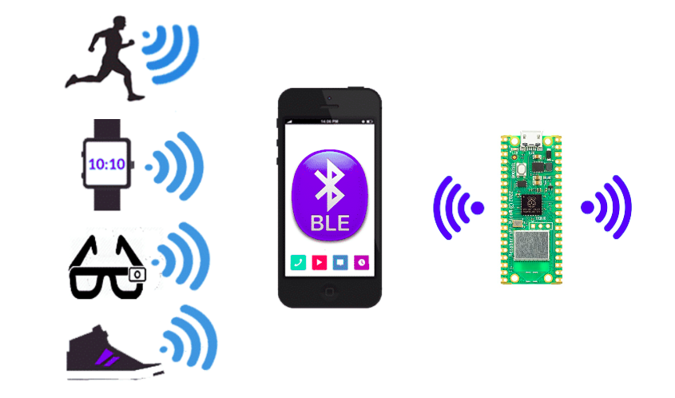

# Mexendo com Bluetooth no Raspberry Pi Pico W

    

Neste projeto, vamos descobrir como utilizar o Bluetooth no Raspberry Pi Pico W para criar um servidor que envia dados via BLE (Bluetooth Low Energy). Antes de mergulharmos no código, vamos explorar os conceitos fundamentais do Bluetooth, usando analogias simples e recursos visuais. **O objetivo é construir uma aplicação prática e funcional, passo a passo, de forma clara e acessível.**
> Esse tutorial está dividido em módulos para organizar melhor as informações e torná-las fáceis de entender. Bons estudos!

# Capítulos

- ## [1) Definição de BLE (Bluetooth Low Energy)](tutorial/1-definicao-ble/definicao.md)
- ## [2) Funcionamento do Bluetooth](tutorial/2-funcionamento/funcionamento.md)
- ## [3) Realizando a Implementação](tutorial/3-implementacao/implementacao.md)

# Conclusão

Bom, é isso! Espero que tenha entendido como funciona o Bluetooth, em especial o BLE,  e como implementar um servidor BLE no Raspberry Pi Pico W. Agora você pode expandir isso da forma que desejar e criar aplicações mais complexas e interessantes.