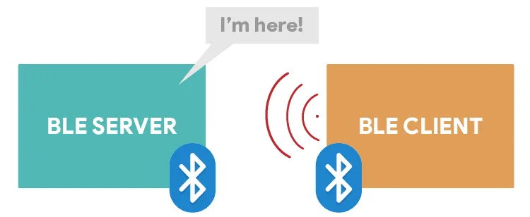
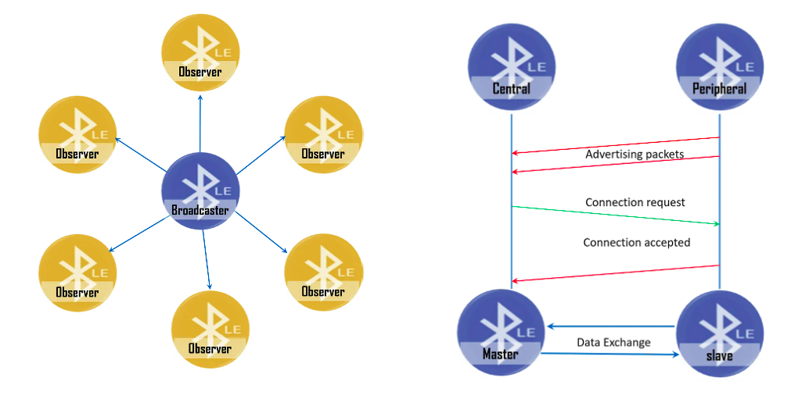
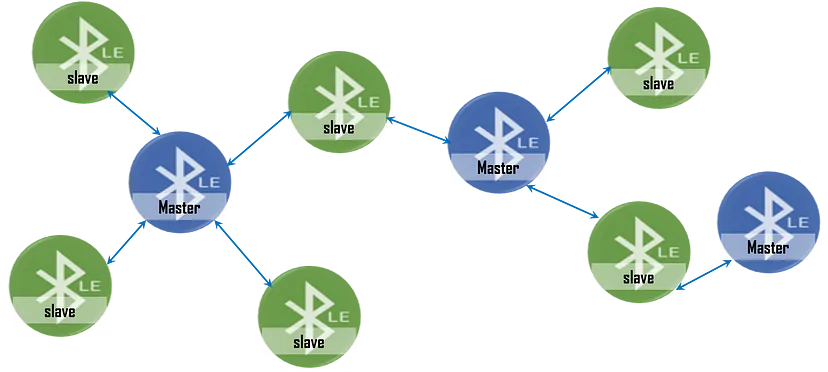
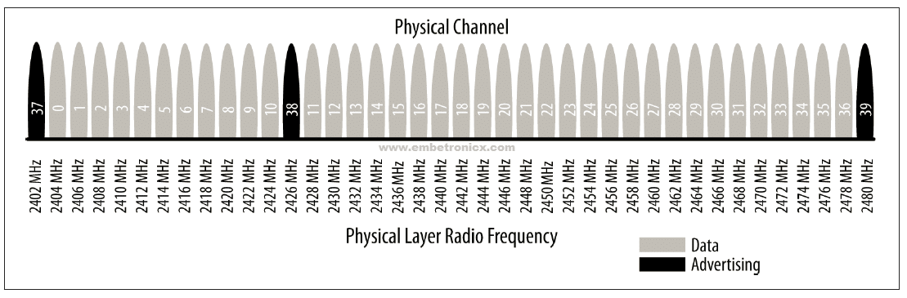

## [Página Principal](../../README.md)

# 1) O que é BLE

    

O **Bluetooth Low Energy (BLE)**, também conhecido como Bluetooth Smart, é uma versão do Bluetooth projetada para transmitir dados com o **mínimo consumo de energia**. 
> A partir da versão 4.0 da Especificação Principal do Bluetooth, o SIG (Special Interest Group) do Bluetooth introduziu o BLE com a intenção de torná-lo um elemento chave para aplicações de IoT de baixo consumo de energia.

Diferente do Bluetooth clássico, que é otimizado para transmissões contínuas, como streaming de áudio, o BLE é ideal para dispositivos que enviam **pequenas quantidades de dados de forma esporádica**, como sensores que medem a temperatura a cada minuto.

Essa economia de dados é feita sacrificando a taxa de transmissão de dados. Sacrificar a taxa de transmissão se refere a dois mecanismos aqui:

1. Os pacotes de dados são menores, variando de 27 a 251 bytes. 
2. Os dados são enviados o mais raramente possível para evitar longos períodos com o rádio ligado, o que é um fator significativo no consumo de energia.

## 1.1 A principal diferença

    

Dentro do BLE, existem 2 formas principais de comunicação entre dispositivos, cada um adequado a diferentes necessidades:

- #### [Transmissão (Broadcast)](./modos-funcionamento/broadcast.md): Quando os dispositivos se comunicam sem estabelecer uma conexão primeiro, transmitindo pacotes de dados para todos os dispositivos dentro do alcance.
    > 🚩 O mecanismo de broadcast é uma das grandes diferenças entre o Bluetooth LE e o Bluetooth "clássico".
- #### [Conexão (Connection)](./modos-funcionamento/connection.md): Quando há uma conexão dedicada entre dispositivos, formando uma comunicação bidirecional.

## 1.2 Explicação da Arquitetura

    

No BLE, os dispositivos assumem dois papéis:

- **Central/Master:** É o "chefe" que procura dispositivos BLE por perto e inicia conexões. Eles escaneiam os sinais e decidem com quem conversar.
    > Exemplos: smartphones, tablets ou computadores.
- **Peripheral/Slave:** É o dispositivo que "anuncia" sua presença enviando sinais (advertising) e aceita conexões quando solicitado. 
    > Exemplos: sensores de temperatura, pulseiras fitness...

### Detalhes Técnicos

Um hardware de Bluetooth LE opera na faixa de 2,4 GHz, a mesma do Bluetooth clássico e de outros protocolos como Wi-Fi. Ele divide o espectro em 40 canais, cada um separado por 2 MHz, com 37 canais usados para a transmissão de dados e os 3 últimos (37, 38 e 39) para anúncios (advertising).

    

> Pense nos canais como diferentes estações de rádio que um dispositivo pode sintonizar para transmitir ou escutar informações
---
## Entendendo canais (Extra)

> Entender como esses dados são enviados pelo ar ainda é um pouco abstrato, eu sei. Caso queira entender melhor como isso é possível, veja [aqui](./introducao-modulacao.md)
---

## 1.3 Limitações e Características

| Característica              | Bluetooth Clássico         | Bluetooth Low Energy (BLE)      |
|------------------------------|-----------------------------|------------------------------------|
| **Frequência**               | 2,4 GHz                     | 2,4 GHz                            |
| **Alcance de Cobertura**     | 10 a 100 metros             | Geralmente 5 a 10 metros (pode chegar a 150 metros em campo aberto) |
| **Taxa de Transferência**    | 1 a 3 Mbps                  | 125 Kb/s a 2 Mb/s                            |
| **Máximo de Dispositivos**   | 7                           | Sem limite                         |
| **Latência de Dados**        | ~2,5 ms                     | ~3 ms                              |
| **Latência de Conexão**      | ~100 ms                     | < 6 ms                              |
| **Canais**                   | 79 canais com espaçamento de 1 MHz | 40 canais com espaçamento de 2 MHz (3 canais de anúncio e 37 canais de dados) |
| **Topologia**                | Ponto a Ponto (1:1)         | Ponto a Ponto (1:1), Broadcast (1: n), Malha (n: n) |

No entanto, **é importante frisar que esses valores são apenas uma média geral, pois muda dependendo de vários fatores.** Por exemplo, o alcance depende da potência de transmissão e das condições do ambiente (paredes, interferências, etc.). O próprio site do Bluetooth tem uma calculadora para ajudar a ter uma ideia do alcance esperado, dependendo das configurações que você colocar. Veja em [Understanding Bluetooth® range](https://www.bluetooth.com/learn-about-bluetooth/key-attributes/range/)

---
> A especificação do Bluetooth LE é extensa, com milhares de páginas. Se quiser se aprofundar, veja veja [aqui](https://www.bluetooth.com/specifications/specs/core-specification-6-0/)
---
## [Funcionamento do Bluetooth](../2-funcionamento/funcionamento.md)
