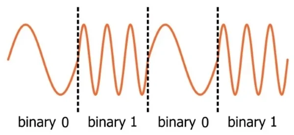
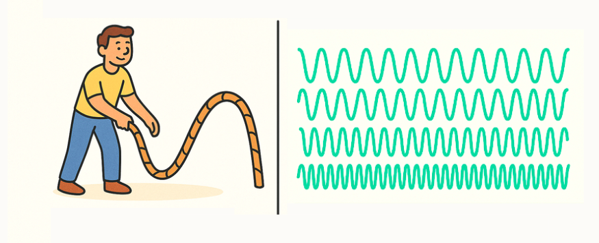
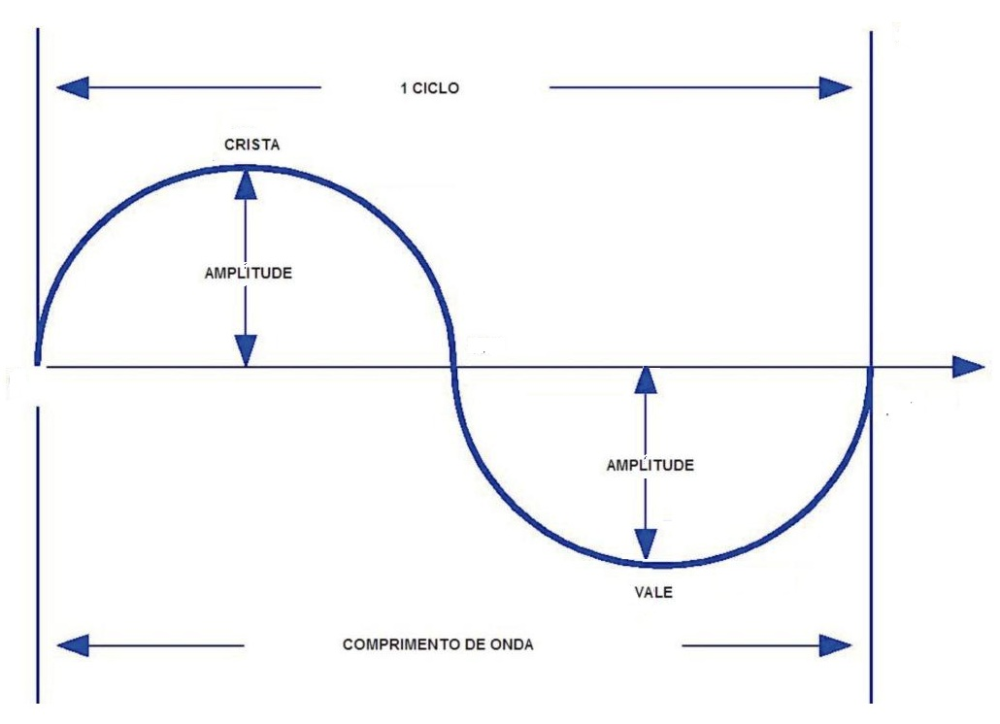
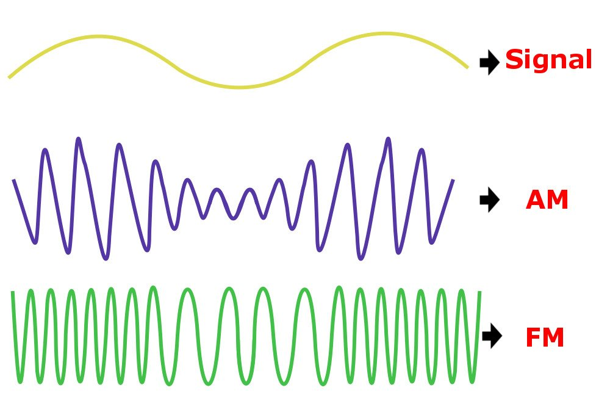
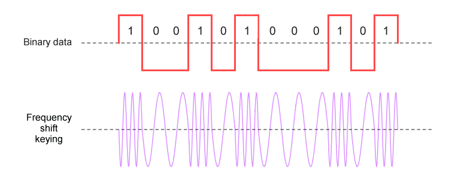

# Introdução à Modulação no BLE

    

A **frequência** é um conceito que não vemos diretamente — ondas de rádio são invisíveis, e tudo acontece em milissegundos. No entanto, é apenas um jeito de "codificar" os dados em vibrações rapidíssimas que viajam pelo ar. Lembre-se: todos os dados digitais são apenas binários.

Tudo que precisamos fazer é usar alguma coisa que possa mudar entre dois estados para representar 0 ou 1. Fisicamente é fácil, já que podemos usar algum componente elétrico que pode ser carregado (1) ou descarregado (0). Mas como fazer isso pelo ar? A resposta está em usar **ondas de rádio**!

---

## O que é uma Onda de Rádio?

    

Uma onda de rádio é uma vibração invisível que viaja pelo ar, igual uma corda que alguém balança de longe. Só que, em vez de você ver essa corda, tudo acontece em velocidades tão rápidas que nossos olhos nem percebem — mas os dispositivos conseguem "sentir" essas vibrações. **Essas ondas são criadas por dispositivos eletrônicos que fazem o ar "vibrar" de maneira controlada.**

No caso do BLE (Bluetooth Low Energy), essas vibrações acontecem numa frequência bem alta — na faixa dos 2,4 GHz.
> Utilizando a comparação da corda, é como se a corda balançasse 2,4 bilhões de vezes POR SEGUNDO! Essa onda é o "veículo" que transporta dados.

## Como usamos a onda

| Características de uma onda | Modulação AM e FM |
|:-------------:|:-----------------:|
|  |  |

Primeiro, vamos lembrar as três características principais de uma onda:

1. **Amplitude:** A "altura" ou intensidade da onda, que determina sua força.
2. **Ciclo:** É definido como uma oscilação completa, que inclui uma subida e uma descida
3. **Frequência:** A quantidade de ciclos completos da onda que ocorrem em um segundo (medida em Hertz, Hz).

Para transmitir dados binários, **modificamos alguma dessas propriedades da onda para representar os 0s e 1s.** Os principais tipos de modulação usados são:

- **Modulação de Amplitude (AM):** A amplitude (intensidade) da onda é alterada. Imagine uma onda de rádio como uma onda no mar. Se a onda for alta (muita energia), é 1; se for baixa (pouca energia), é 0.
- **Modulação de Frequência (FM):** A frequência (quantidade de oscilações por segundo) da onda é alterada. Pense em uma onda de rádio como uma música. Se o tom sobe (frequência alta), é 1; se desce (frequência baixa), é 0.

O Bluetooth utiliza uma modulação chamada GFSK (Gaussian Frequency Shift Keying, ou Modulação por Deslocamento de Frequência Gaussiana), que é um tipo específico de FM.

## GFSK: Gaussian Frequency Shift Keying

No BLE, o método mais comum de modulação é chamado de **GFSK** (*Gaussian Frequency Shift Keying*, ou Modulação por Desvio de Frequência Gaussiana). Apesar do nome técnico, o conceito é simples:

1. O dispositivo envia uma onda de rádio na frequência do canal escolhido (ex.: **2402 MHz** para o canal 37).
2. Para representar um **1**, ele **aumenta ligeiramente a frequência** (ex.: para **2402,5 MHz**).
3. Para representar um **0**, ele **diminui ligeiramente a frequência** (ex.: para **2401,5 MHz**).

Essas mudanças são **sutis e rápidas**, mas o receptor consegue detectá-las e tratar como 0 ou 1 para entender nossa informação.

    

## Por que a modulação não altera o canal?
Uma pergunta que você pode ter é: Por que não muda de canal já que aumentamos a frequência? Isso ocorre porque cada canal tem uma largura de 2MHz, ou seja, basta a variação está dentro dessa faixa. Por exemplo:
- Canal 37 vai de 2401 MHz a 2403 MHz, com 2402 MHz como o "centro".
- Canal 38 vai de 2425 MHz a 2427 MHz, com 2426 MHz como o centro.

Isso significa que qualquer frequência dentro dessa faixa de 2 MHz ainda pertence ao mesmo canal. O transmissor e o receptor estão "sintonizados" para trabalhar dentro dessa faixa.

No GFSK usado pelo BLE, a alteração na frequência para representar 0s e 1s é chamada de desvio de frequência (frequency deviation) e é tipicamente ±250 kHz (ou ±0,25 MHz). Então:

- Para um 1, a frequência sobe para 2402 MHz + 0,25 MHz = 2402,25 MHz.
- Para um 0, a frequência desce para 2402 MHz - 0,25 MHz = 2401,75 MHz.
> Essas mudanças (±0,25 MHz) são muito menores que a largura do canal (2 MHz). Elas ficam confortavelmente dentro da faixa do canal 37 (2401 a 2403 MHz).

---

## Exemplo Prático: Enviando um dado

Imagine que você quer enviar o o número 5 para um cliente bluetooth. Nesse caso, 5 é  `101` em binário. Então vamos fazer assim:

1. O transmissor BLE gera uma onda a **2402 MHz**.
2. Para o primeiro bit (**1**), ele **aumenta a frequência** um pouquinho.
    > A frequência sobe para 2402 + 0,25 = 2402,25 MHz.
3. Para o segundo bit (**0**), ele **diminui a frequência** um pouquinho.
    > A frequência desce para 2402 - 0,25 = 2401,75 MHz.
4. Para o terceiro bit (**1**), ele **aumenta a frequência** novamente.
    > Volta para 2402,25 MHz.

Pronto, O celular recebe tudo certinho, decodifica como 101, e você vê isso no seu app. Com isso, o receptor BLE consegue interpretar as variações na frequência e reconstruir os dados originais!

---
## [Definição de BLE](definicao.md)