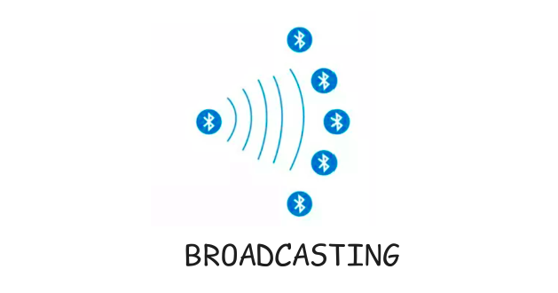

# Broadcast

    

No modo broadcast, um dispositivo BLE envia dados para qualquer aparelho próximo, sem precisar de uma conexão formal ou pareamento. Pense em um sinal de rádio: o dispositivo, chamado broadcaster, "transmite" informações regularmente, e qualquer dispositivo configurado para "ouvir", chamado observer, pode captar esses dados.

> De acordo com o [GAP](../../2-funcionamento/host-partes/gap.md), a comunicação no broadcast é unidirecional (apenas do broadcaster para o observer) e usa uma topologia em estrela, onde um dispositivo central envia dados a vários receptores