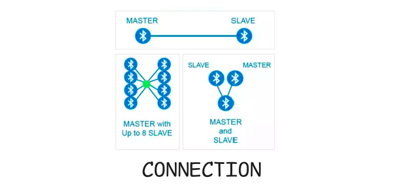

# Connection

    

No modo de conexão, um dispositivo central (como um smartphone ou computador) detecta os pacotes de anúncio de um dispositivo periférico (como um sensor ou relógio) e, em seguida, envia um pedido para estabelecer uma comunicação mais robusta.

Após a conexão ser estabelecida, ambos os dispositivos podem trocar dados bidirecionalmente, ou seja, **eles podem enviar e receber dados entre si.**

> Esse modo é ideal quando você precisa de uma comunicação contínua, confiável e bidirecional
### Como funciona?

1. Um dispositivo **central** detecta os pacotes de anúncio enviados por um dispositivo **periférico**.
2. O central envia um **pedido de conexão** ao periférico.
3. Após o periférico aceitar o pedido, a conexão é estabelecida, definindo os papéis:
   - O dispositivo que inicia a conexão torna-se o **mestre** (central).
   - O dispositivo que aceita a conexão torna-se o **escravo** (periférico).