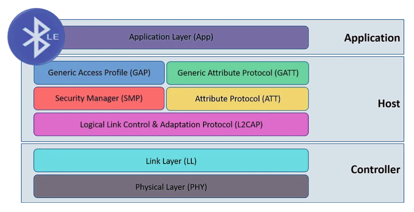
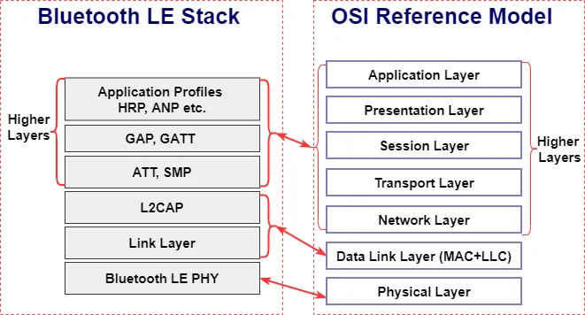
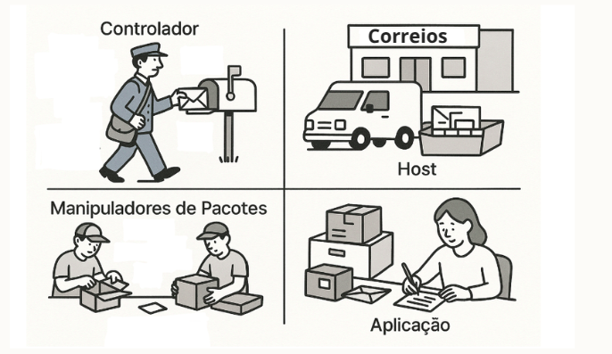

## [Definição](../1-definicao-ble/definicao.md)
---
# Como funciona a comunicação BLE

    

 A pilha de protocolo Bluetooth Low Energy é organizada em camadas, semelhante ao que ocorre no [modelo OSI](https://pt.wikipedia.org/wiki/Modelo_OSI). São elas:

 - [Controlador (Carteiro)](#21-controlador): Transmite e recebe os sinais de rádio
 - [Host (Centro de Triagem)](#22-host): Organiza e direciona os dados recebidos e a serem enviados.
 - [Manipuladores de pacotes (Funcionários Internos)](#23-manipuladores-de-pacotes): Processam e estruturam os dados para a comunicação.

    > Essa camada é específica do BTstack
- [Aplicação (Leitor/Escritor)](#24-aplicação): Utiliza os dados para realizar a função desejada

### Imagem comparativa com o OSI

    

---

## 2.1) Controlador

É a camada física da pilha BLE, implementada no hardware. No Raspberry Pi Pico W, por exemplo, o chip **CYW43439** desempenha esse papel. Ele opera na frequência de 2.4 GHz, convertendo sinais de rádio em dados digitais usando [Modulação GFSK](https://www.everythingrf.com/community/what-is-gfsk-modulation) (uma técnica que modula sinais para transmissão eficiente).

> Imagine como a "antena e o rádio" do sistema, responsável por captar e transmitir sinais pelo ar.

O Controlador é composto por três camadas principais:

- **Physical Layer (PHY):** Especificamente, ela define a modulação e demodulação dos dados em ondas de rádio.

- **Link Layer (LL):** Gerencia a comunicação sem fio em nível de enlace, estruturando os dados em pacotes, gerenciando estados (anunciante, scanner, mestre, escravo), estabelecendo conexões e otimizando o consumo de energia. Algumas funcionalidades incluem:

    - Enquadramento (organização geral do pacote BLE)
    - Geração e verificação de CRC (verificação de erros)
    - Criptografia AES (segurança em baixo nível)

- **Host Controller Interface (HCI) — Controller side:** Ponte de conexão entre o Controlador e o Host.

## 2.2) Host
 Enquanto o Controlador lida com a transmissão física, o Host lida com a lógica e a inteligência da comunicação. Ele é responsável por gerenciar as conexões com outros dispositivos BLE, implementar os vários protocolos BLE que definem como os dispositivos se comunicam entre si e fornecer os serviços de alto nível que as aplicações utilizam.

 > O BTstack é uma implementação da parte do Host. Ele fornece todas as funções necessárias para que seu aplicativo ou sistema possa usar Bluetooth sem precisar se preocupar com os detalhes técnicos de baixo nível.

Dentro da camada Host, existem várias subcamadas ou componentes que lidam com aspectos específicos da lógica de comunicação:
- [Host-Controller Interface (HCI)](./host-partes/hci.md)
- [Logical Link Control and Adaptation Protocol (L2CAP)](./host-partes/l2cap.md)
- [Attribute Protocol (ATT)](./host-partes/att.md)
- [Generic Attribute Profile (GATT)](./host-partes/gatt.md)
- [Security Manager Protocol (SMP)](./host-partes/smp.md)
- [Generic Access Profile (GAP)](./host-partes/gap.md)

## 2.3) Manipuladores de pacotes
Esta é uma camada específica do BTstack, localizada entre o Host e a Aplicação. Ela facilita a interação em tempo de execução, **gerenciando o envio e recebimento de eventos e dados entre a aplicação e as camadas inferiores.**

## 2.4) Aplicação
A Aplicação é a camada mais alta, **onde reside o código específico do usuário e a lógica do projeto**. Ela interage com as camadas inferiores por meio dos Manipuladores de Pacotes (no BTstack) ou diretamente com as APIs GAP e GATT em implementações tradicionais.
- Exemplo: Um aplicativo que lê a temperatura de um sensor BLE e a exibe em uma interface gráfica.

# Resumo básico da interação

1. O Controlador inicia o processo transmitindo sinais de rádio na frequência de 2.4 GHz. O HCI (Host-Controller Interface) coordena a comunicação entre o hardware (Controlador) e o software (Host). 

2. Em seguida, o L2CAP organiza os pacotes de dados, dividindo-os ou recombinando-os conforme necessário. 

3. Os protocolos ATT e GATT estruturam os dados, como a temperatura de um sensor, em atributos e características para acesso padronizado.

4. O SMP assegura a segurança da conexão por meio de pareamento e criptografia. O GAP (Generic Access Profile) gerencia a descoberta do dispositivo e a conexão com outros, como um smartphone.

5. Por fim, no BTstack, os Manipuladores de Pacotes entregam os dados à Aplicação, que processa e exibe as informações, como mostrar a temperatura em uma interface.

    

---
## [Implementação](../3-implementacao/implementacao.md)