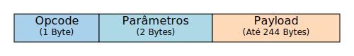

## ATT (Attribute Protocol)

O ATT é o protocolo que organiza e gerencia como dispositivos trocam informações, **organizando como os dados são armazenados no Servidor e como o Cliente pode acessá-los, seja para leitura (como verificar a frequência cardíaca) ou escrita (como atualizar a hora).** Ele opera em uma arquitetura Cliente-Servidor, semelhante à interação entre um navegador e um site na internet. 

## A organização

    

O ATT organiza os dados em unidades chamadas **ATRIBUTOS**, que são como fichas digitais contendo informações específicas. Cada atributo tem quatro partes:

| Campo       | O que é?                                        | Exemplo                        |
|-------------|--------------------------------------------------|--------------------------------|
| **Handle**  | Identificador único do atributo (como um ID).    | `0x0001` (número único)        |
| **Type**    | Tipo de dado (o que ele representa).             | "Frequência cardíaca" ou "Nível de bateria" |
| **Permissions** | Regras de acesso (quem pode ler/escrever). | "Só leitura" ou "Leitura e escrita" |
| **Value**   | O dado em si.                                    | "75 bpm" (batimentos por minuto) |

> O Handle pode ser de 16 bits, atribuído pelo Bluetooth Special Interest Group (SIG), ou um UUID personalizado de 128 bits. Você pode ver mais detalhes na página do [GATT](./gatt.md).

Assim, quando o celular (Cliente) quer acessar esse dado, ele envia um comando ao ATT: "Leia o atributo com Handle `0x0001`." O ATT verifica as permissões, retorna o valor (como "80 bpm"), e o celular exibe a informação. Alguns exemplos de métodos ATT:
- **Leitura de um atributo:** `att_read_callback_handle_blob()`
- **Ativa notificações do Cliente:** `att_server_request_can_send_now_event()`

## Estrutura de um pacote

O ATT define 6 tipos de "pacote" (PDU): 

- Solicitação (request)
- Resposta (response)
- Comando (command)
- Confirmação (confirmation)
- Notificação (notification)
- Indicação (indication)

Cada pacote do ATT é composto por três partes principais:

    

- **Opcode:** Esse campo identifica qual é o tipo de PDU — por exemplo, se é uma solicitação, uma resposta, um comando, uma notificação etc.
- **Parâmetros de atributo:** São os dados específicos relacionados ao atributo sendo acessado ou modificado, como o identificador do atributo (handle), seu tipo, valor, etc.
- **Assinatura de autenticação (Opcional):** Contém uma assinatura digital usada para verificar que o pacote veio de uma fonte confiável e que seu conteúdo não foi alterado.

## ATT x GATT

Depois, o GATT, que é uma camada acima do ATT,  organiza os atributos de maneira mais estruturada e padronizada, criando um perfil que facilita a conexão entre dispositivos.

> A forma mais simples de entender isso é que o GATT é o responsável por definir os dados e como interagir com eles. Já o ATT é o que trabalha de fato com eles, movendo de um lado para o outro.

No fluxo de comunicação:

1. O ATT gera uma solicitação (por exemplo, "ler o atributo com handle 0x0004").
2. Essa solicitação é passada ao L2CAP, que a encapsula em um pacote com o CID 0x0004 (indicando que é para o ATT).
3. O L2CAP fragmenta o pacote, se necessário, e o envia.

---
## Próxima camada: [GATT](./gatt.md)