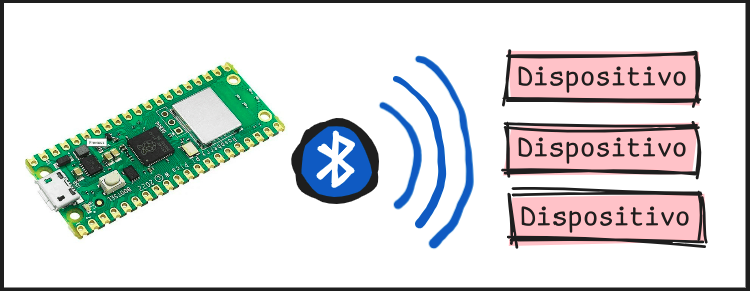
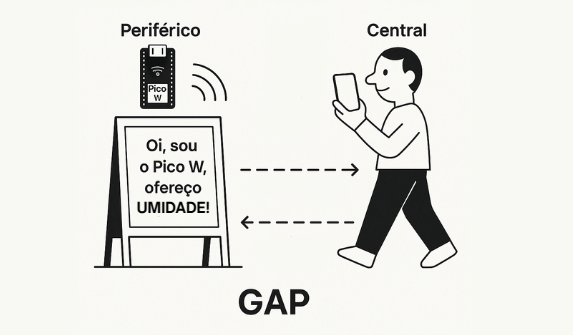

### 2.2.5) GAP (Generic Access Profile): A porta de entrada

O GAP (Generic Access Profile) é a "porta de entrada" do BLE, responsável pELA descoberta, conexão e interação entre os dispositivos. Ele faz dispositivos como o Pico W anunciarem sua presença e permite que um celular os encontre e conecte.

> É como um convidado que levanta a mão e diz: "Oi, sou o Pico W, quero conversar sobre temperatura. Alguém quer conversar comigo?"

## Como funciona na prática?
Pense no GAP como um sistema de cartazes e olheiros em uma feira:

 - O Periférico (ex.: Pico W) coloca um cartaz (pacote de advertising) dizendo: "Oi, sou o Pico W, ofereço umidade!" Esse cartaz é enviado em canais de anúncio (37, 38, 39 na faixa de 2,4 GHz).

- O Central (ex.: celular) é como um olheiro que lê os cartazes enquanto passeia pela feira. Quando vê o cartaz do Pico W, decide se quer "conversar" (conectar).

- Se o Central quiser, ele envia um pedido de conexão, e o GAP negocia os detalhes (ex.: intervalo de conexão, canais de dados) para que a conversa comece.

> O GAP é a porta de entrada que leva ao ATT. Após a conexão, o ATT gerencia os atributos (ex.: temperatura, umidade...), permitindo leitura ou notificações. Sem o GAP, o celular não encontraria o Pico W, e o ATT não seria usado, pois não haveria conexão.

---

## [Voltar](../funcionamento.md)