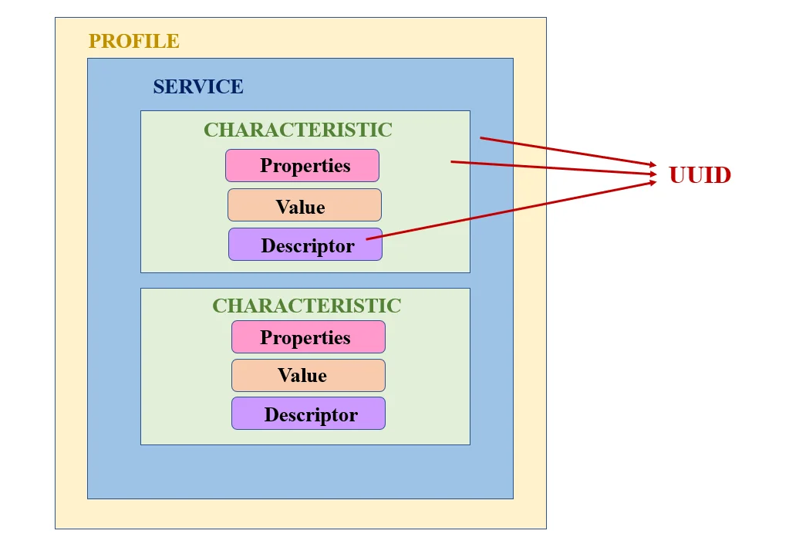

### 2.2.1) GATT (Generic Attribute Profile): O que você vai expor
---


<div align="center">

</div>


O GATT (Generic Attribute Profile) é o protocolo que define como os dados são organizados, acessados e transmitidos em dispositivos BLE. 

Na prática, _é como criar uma interface em Programação Orientada a Objetos, que estabelece um modelo para estruturar os dados._ Com o GATT, criamos um "arquivo de configuração" que organiza os dados em uma hierarquia com:

- **Serviço:** Uma categoria que agrupa dados relacionados, como uma "pasta" (ex.: Serviço de Sensoriamento Ambiental).
- **Característica:** Um dado específico dentro do serviço (Ex.: Temperadura, Umidade, Pressão etc).
- **Descritor:** Metadados que descrevem ou configuram a característica, como uma "etiqueta". Por exemplo, definir a unidade de medida ou uma faixa de valores válidos.

Agora vamos entender cada parte de forma mais detalhada.

### 2.2.1.1) Serviço
É como a "categoria" dos dados, como, por exemplo, sensor ambiental. Cada serviço é representado por um [UUID](https://en.wikipedia.org/wiki/Universally_unique_identifier) (identificador único). A Bluetooth SIG mantém um catálogo de serviços com UUID padrão, que pode ser encontrado [aqui](https://www.bluetooth.com/specifications/assigned-numbers/). Alguns exemplos:
- **Heart Rate (Frequência Cardíaca):** 0x180D – Usado para dispositivos que medem batimentos cardíacos.
- **Battery Service (Nível de Bateria):** 0x180F – Informa o nível de carga de um dispositivo.
- **Blood Pressure (Pressão Arterial):** 0x1810 – Para dispositivos que monitoram pressão arterial.
- **Current Time (Hora Atual):** 0x1805 – Sincroniza a hora entre dispositivos.


### 2.2.1.2) Características
São os "dados específicos" que o cliente pode acessar. Assim como os serviços, cada característica é representada por um UUID. Alguns exemplos:
  - **Temperature Measurement (Medição de Temperatura):** 0x2A6E – Dados de temperatura, geralmente em graus Celsius.
  - **Pressure (Pressão):** 0x2A6D – Medições de pressão atmosférica, em pascal.
  - **Humidity (Umidade):** 0x2A6F – Níveis de umidade relativa, em porcentagem.

  > A ideia do Bluetooth Low Energy é organizar tudo com IDs, como você já pôde ver. Você quer enviar um dado? Ok, mas o que é? Temperatura? Pressão? Frequência cardíaca? Tudo terá um UUID específico associado
  ### Propriedades (Ações)
  --- 
  As Propriedades definem como o cliente pode interagir com a característica:

| Propriedade | Significado                                                                 |
|-------------|------------------------------------------------------------------------------|
| `READ`      | Permite leitura do valor pelo cliente                                        |
| `WRITE`     | Permite que o cliente envie dados ao dispositivo                             |
| `NOTIFY`    | O valor é enviado automaticamente para o cliente (sem precisar pedir)        |
| `INDICATE`  | Igual ao NOTIFY, mas com confirmação de recebimento pelo cliente             |
| `DYNAMIC`   | O valor é tratado na hora pela aplicação (não é fixo no GATT)                |


  ### Atributos de uma Característica
Cada característica Bluetooth é composta por **atributos**, que são os elementos que definem e descrevem ela com mais detalhamento. Alguns atributos são:

- **Handle**: Um número único que funciona como um "endereço" para identificar o atributo no dispositivo.
- **Tipo**: Um identificador único (UUID) que especifica o tipo de dado. Por exemplo, o UUID `0x2A00` representa o "Nome do Dispositivo".
- **Valor**: O dado em si, ou seja, o conteúdo real que se deseja armazenar ou ler. Exemplo: `25.5°C` para uma medição de temperatura.
- **Operações Permitidas (Propriedades)**: Define as ações que podem ser realizadas com a característica, como o READ ou WRITE.

> Imagine que a característica "Temperatura" é uma gaveta. Dentro dessa gaveta, há várias etiquetas (os atributos). Uma etiqueta diz "valor: 25.5°C" (atributo com o dado), a outra diz "tipo: temperatura" (atributo com UUID 0x2A6E) e a outra diz "pode ser lido" (atributo com operação READ...

O dispositivo que contém esse banco de dados que será acessado é chamado de "servidor", enquanto o que acessa esse banco de dados remoto é chamado de "cliente".
  ### Servidor GATT
  Ao invés de implementar o servidor GATT diretamente, o BTstack usa um compilador de perfil GATT para transformar uma descrição textual do perfil GATT (usando valores separados por vírgula) em um banco de dados de atributos ATT (o ATT é o protocolo que o GATT usa). Esse arquivo é algo como: 
  ```md
  PRIMARY SERVICE, {<UUID_DO_SERVICO>}
  CHARACTERISTIC, {<UUID_TIPO_ATRIBUTO>}, {<PROPRIEDADES>}, {<VALOR>}
  CHARACTERISTIC, {<UUID_TIPO_ATRIBUTO>}, {<PROPRIEDADES>}, {<VALOR>}
  ```
  Exemplo de arquivo GATT para definição do nome do servidor (nome que aparece para se conectar):
  ```md
  PRIMARY_SERVICE, GAP_SERVICE
  CHARACTERISTIC, GAP_DEVICE_NAME, READ, "picow_server"
  ```

  Você pode ver a definição oficial [aqui](https://bluekitchen-gmbh.com/btstack/v1.0/profiles/#lst:GATTServerProfile). A explicação mais detalhada desse arquivo será abordada na implementação do servidor.

### 2.2.1.3) Descritor
Dá informações extras sobre como lidar com o dado, como "me avise a cada X segundos" ou infos sobre a unidade (graus, %, etc)

---
## Próxima camada: [SMP](./smp.md)
