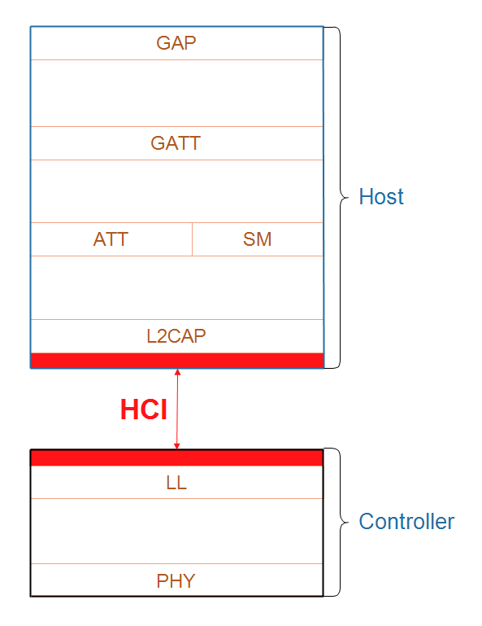

## HCI (Host-Controller Interface): A ponte entre cérebro (software) e os músculos (hardware)

    

O HCI (Host-Controller Interface) é uma interface de comunicação padronizada que conecta duas partes principais do sistema Bluetooth:

- **O Host:** A parte lógica, geralmente o software rodando em um microcontrolador (como o RP2040 no Raspberry Pi Pico W)
- **O Controlador:** A parte física, o hardware Bluetooth (como o chip CYW43439 no Pico W)

> A especificação do Bluetooth define o HCI como **um conjunto de comandos e eventos para o host e o controlador interagirem entre si,** além de um formato de pacotes de dados e um conjunto de regras para o controle do fluxo de informações.

O HCI atua como uma "linguagem comum" entre o host e o controlador, garantindo que eles possam trabalhar juntos de forma eficiente, mesmo sendo implementados em componentes diferentes.

---
## Explicando melhor
O HCI possui 3 tipos de pacotes:

- **Comandos HCI:** Instruções do software para o chip (ex.: "Ligue o rádio", "Anuncie o nome 'Pico'").
- **Eventos HCI:** Respostas ou notificações do chip para o software (ex.: "O rádio foi ligado", "Um celular se conectou").
- **Pacotes de dados HCI:** Dados do aplicativo (ex.: valores de um sensor) enviados ou recebidos pelo chip.
    > Esse ainda pode ser síncrono ou assíncrono.

No Pico W, essas mensagens HCI são enviadas através de uma conexão física SPI (Serial Peripheral Interface) entre o RP2040 e o CYW43439. Então, é como se ele fosse realmente uma espécie de "compilador", que transforma a parte de alto nível em algo que o controlador entende (ou vice-versa).

Por exemplo, quando a conexão é realizada com sucesso, temos o evento `LE Connection Complete`, que possui o código `0x3E`. Se ocorreu algum erro e deu overflow, temos o evento `Data Buffer Overflow` de código `0x1A`... é como se realmente você tivesse uma tabela de instruções de várias coisas, como as intruções de um processador. Aqui está uma
 tabela comparativa para simplificar:

 | **HCI Command (BLE)**        | **CPU Opcode (Processador)**                |
|:-----------------------------|:-------------------------------------------|
| Um código que diz ao controlador BLE o que fazer. | Um código que diz ao processador o que fazer. |
| Ex: "LE Create Connection" (0x200D) diz: **"crie uma conexão BLE"** | Ex: "ADD" (0x01) diz: **"some dois valores"** |
| O controlador executa o comando e depois manda um evento de resposta. | O processador executa a operação e atualiza registradores ou memória. |

---
## Pŕoxima camada: [L2CAP](./l2cap.md)