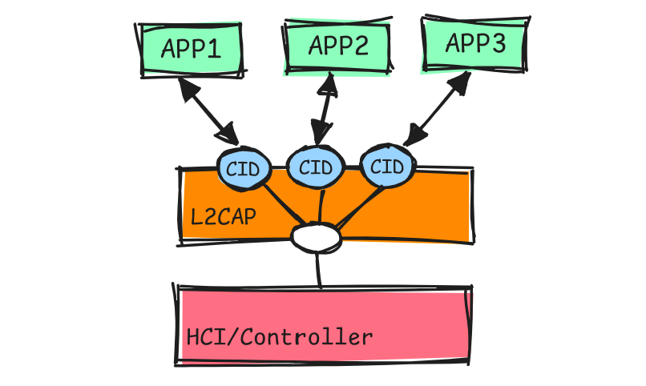
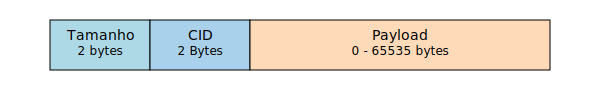

## L2CAP (Logical Link Control and Adaptation Protocol): O tradutor e organizador dos dados

    

O L2CAP (Logical Link Control and Adaptation Protocol) **funciona como um "organizador de tráfego" para os dados Bluetooth.**
- **Framentação e recombinação:** O L2CAP quebra os pacotes grandes em pedaços menores para as camadas inferiores e junta os pedaços que recebe antes de repassá-los para cima.

- **Multiplexação:** Permite que múltiplos protocolos (ATT, SMP) funcionem ao mesma tempo. Cada protocolo usa um canal L2CAP identificado por um CID (Channel Identifier). No BLE, alguns CIDs fixos incluem:
  - CID 0x0004: Usado pelo ATT.
  - CID 0x0005: Usado pelo SMP.
  - CID 0x0006: Usado para sinalização.

  > Lembra dos canais do Bluetooth? O L2CAP usa canais, que são como "conexões" para enviar dados. Cada canal é ligado a um único protocolo e você pode ter vários canais usando o mesmo protocolo. Porém, um canal não pode ser ligado a mais de um protocolo, e é assim feito a organização.
---
**Cada unidade de dados do protocolo (PDU) pode conter apenas um comando.** As PDUs que transportam mensagens de sinalização L2CAP são conhecidas como C-frames (quadros de controle). 

    

Já os quadros de dados são classificados em B-frames (quadros de informação básica), usados para transmissão de dados padrão, e LE-frames (quadros de informação de baixa energia), utilizados para transmissão de dados em modo de baixo consumo. Essa estrutura garante uma comunicação eficiente no BLE.

---
## Pŕoxima camada: [ATT](./att.md)