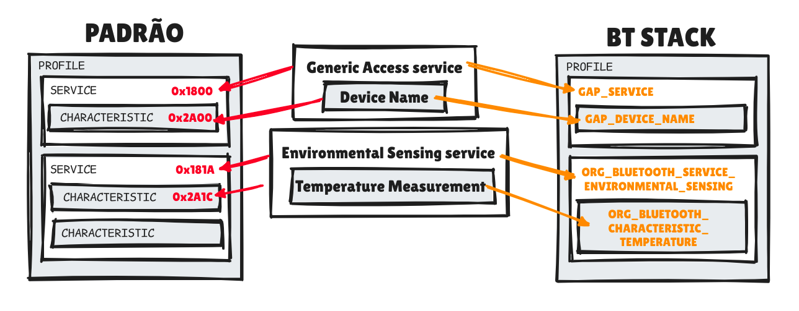
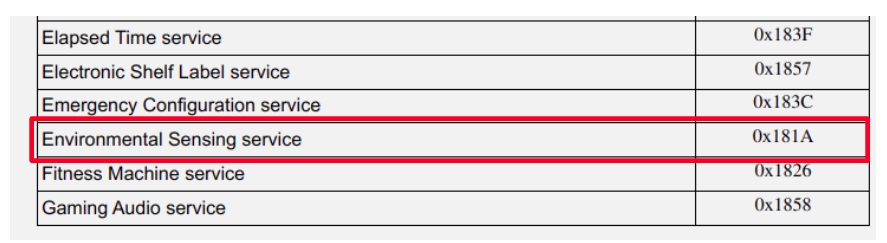
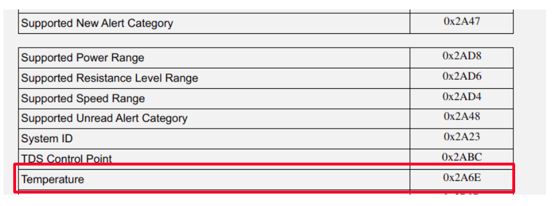

# Definindo os dados (GATT)
  Antes de tudo, precisamos definir os dados que o Pico W vai anunciar. Para isso, vamos criar um arquivo com a extensão `.gatt` na raiz do nosso projeto. 

  > Lembrando que o GATT é nosso "contrato", que diz o que vai ser compartilhado com o cliente. Lembre [aqui]()
  
  O nome você que sabe, mas irei colocar como `config.gatt` para facilitar o entendimento. Agora que criamos ele, precisamso editar o CMakeLists.txt para dizer que estamos usando um arquivo separado de GATT. Fazemos isso adicionando a linha:

  ```cmake
  pico_btstack_make_gatt_header(picow_ble_temp_sensor PRIVATE "${CMAKE_CURRENT_LIST_DIR}/config.gatt")
  ```
  > Se você colocou outro nome, é só mudar esse `config.gatt` por aquele que você botou...

  Não vou entrar em tantos detalhes, mas o que essa linha faz é utilizar um script chamado `compile_gatt.py` (Veja esse script [aqui](https://github.com/bluekitchen/btstack/blob/master/tool/compile_gatt.py)) que irá converter o `.gatt` para um arquivo `.h` que será incluído no nosso código. Esse `.h` vai conter um objeto chamado `profile_data`, que será nosso objeto de configuração. **Ou seja, É ISSO QUE NOSSO ATT VAI USAR!**


## Escrevendo o GATT
Agora que já criamos nosso arquivo GATT (também chamado de Perfil), vamos escrever o que queremos que ele faça. Lembremos que o GATT é composto por SERVIÇOS, CARACTERÍSTICAS e PROPRIEDADES. **Cada uma dessas coisas são IDs, mas o BTstack simplifica isso trazendo uma nomeclatura escrita.**

<p align="center">
    
</p>


  
- **Lista de serviços:** https://www.bluetooth.com/wp-content/uploads/Files/Specification/Assigned_Numbers.html#bookmark102 
  
- **Lista de características:** https://www.bluetooth.com/wp-content/uploads/Files/Specification/Assigned_Numbers.html#bookmark110
- **Lista de propriedades:** https://bluekitchen-gmbh.com/btstack.pdf (Página 67)
    
Nesse caso, vamos criar um serviço do tipo "Sensoriamento Ambiental" e uma propriedade do tipo "Temperatura". [Assim como já citado no topico sobre GATT](../../../2-funcionamento/host-partes/gatt.md), O padrão é:
```md
PRIMARY SERVICE, {<UUID_DO_SERVICO>}
CHARACTERISTIC, {<UUID_TIPO_ATRIBUTO>}, {<PROPRIEDADES>}, {<VALOR>}
CHARACTERISTIC, {<UUID_TIPO_ATRIBUTO>}, {<PROPRIEDADES>}, {<VALOR>}
```
Nesse caso, vamos cirar um serviço do tipo "Sensoriamento Ambiental". Podemos ver que ele possui um UUUD e um nome:

<p align="center">
    
</p>
  
O BTstack permite que usemos ambas as formas de identificar um serviço. Nesse caso, usarei o nome, pois é mais fácil de ler e entender. No serviço, usamos o padrão `ORG_BLUETOOTH_SERVICE_<NOME-DO-SERVIÇO>`:
  
```c  
PRIMARY_SERVICE, ORG_BLUETOOTH_SERVICE_ENVIRONMENTAL_SENSING
``` 
Agora, vamos criar as características. Cada característica possui um UUID, um tipo e um valor (lembre [aqui](#2212-características)). Como estamos usando um tipo já padronizado pela documentação, vamos usar um UUID padrão de característica também:

<p align="center">
    
</p>
  
Assim como no serviço, usamos o um padrão parecido:
```md
ORG_BLUETOOTH_CHARACTERISTIC_<NOME-DA-CARACTERISTICA> | <PROPRIEDADE>
```
Por exemplo, para criar uma característica de temperatura, faremos:
    
```md
CHARACTERISTIC, ORG_BLUETOOTH_CHARACTERISTIC_TEMPERATURE, READ | NOTIFY | INDICATE | DYNAMIC
```
  
> Lembre-se que o `DYNAMIC` é usado para características que podem ser alteradas dinamicamente (Veja as possibilidades [aqui](../../../2-funcionamento/host-partes/gatt.md#2212-características)). Pronto, já definimos nosso serviço e característica! Isso já é suficiente para o nosso dispositivo funcionar.
  
No entanto, é comum ter outros serviços além do dado em si que estamos enviando, como o `GATT_SERVICE`, que traz informações sobre o dispositivo. As propriedades mais comuns são:
  - `GAP_DEVICE_NAME`: Nome do dispositivo
  - `GATT_DATABASE_HASH`: Hash do banco de dados GATT

---
## 🔗 Trecho Completo
```md
PRIMARY_SERVICE, GAP_SERVICE
CHARACTERISTIC, GAP_DEVICE_NAME, READ, "picow_learning"
    
PRIMARY_SERVICE, GATT_SERVICE
CHARACTERISTIC, GATT_DATABASE_HASH, READ,
    
PRIMARY_SERVICE, ORG_BLUETOOTH_SERVICE_ENVIRONMENTAL_SENSING
CHARACTERISTIC, ORG_BLUETOOTH_CHARACTERISTIC_TEMPERATURE, READ | NOTIFY | INDICATE | DYNAMIC,
```
---

## Pŕoximo: [Configuração do Anúncio](../2-config-anuncio/config-anuncio.md)