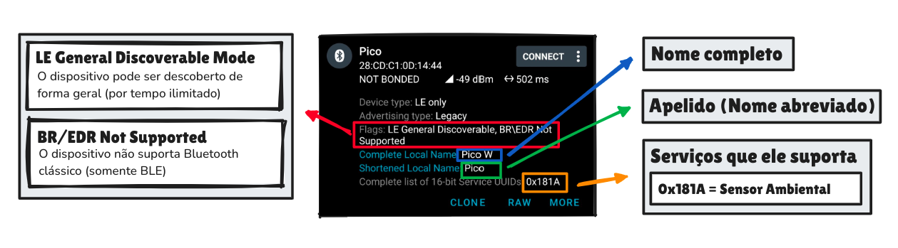

# Configuração do Anúncio (GAP)

Ok, então para começarmos a anunciar nosso dispositivo, vamos criar nossa configuração. **Ele é organizado em um array,** onde cada campo é composto na seguinte forma:
  ```c
  [TAMANHO], [TIPO], [DADOS]
  ```
  Por exemplo, para definir o nome do dispositivo (que vai aparecer na busca), fazemos o seguinte:
  ```c
  5, BLUETOOTH_DATA_TYPE_SHORTENED_LOCAL_NAME, 'P', 'i', 'c', 'o',
  ```
  Nesse caso, estamos dizendo que vai mostrar um propriedade do tipo "nome curto" com o valor "Pico", que possui 5 bytes de tamanho (contando com o `\0`). Bem simples, não é? 
  
   > Note que o tamanho do campo está como inteiro, mas normalmente isso é definido em hexadecimal. Então, ao invés de 5, seria `0x05`, 7 seria `0x07` e assim por diante. No entanto, isso não faz diferença para o btstack.

Você pode encontrar a lista completa nos links abaixo:
  
  
   - [Bluetooth® Document | Data Types](https://www.bluetooth.com/wp-content/uploads/Files/Specification/Assigned_Numbers.html#bookmark43)
   - [BT Stack | Data Types](https://github.com/bluekitchen/btstack/blob/master/src/bluetooth_data_types.h)
  
   Com o btstack, basta botarmos o nome no formato `BLUETOOTH_DATA_TYPE_<NOME-DATA-TYPE>`. Vamos criar algumas propriedades para mostrar isso na prática:
  ```c
  5, BLUETOOTH_DATA_TYPE_SHORTENED_LOCAL_NAME, 'P', 'i', 'c', 'o',
  7, BLUETOOTH_DATA_TYPE_COMPLETE_LOCAL_NAME, 'P', 'i', 'c', 'o', ' ', 'W',
  3, BLUETOOTH_DATA_TYPE_COMPLETE_LIST_OF_16_BIT_SERVICE_CLASS_UUIDS, 0x1a, 0x18,
  2, BLUETOOTH_DATA_TYPE_FLAGS, 0x06,
  ```
  O nome completo do dispositivo será "Pico W". O nome abreviado será "Pico" e quero que exiba o UUID dos serviços que o dispositivo suporta. Além disso, mostre algums flags sobre ele (como se está em baixo consumo ou se suporta apenas BLE ou também o Bluetooth classico). Para ficar mais claro, é assim que nosso dispositivo será visto na busca (com essas configurações):

  <p align="center">
    
</p>


  ### Configuração do GAP
  No fim, nosso array de configuração será assim:
  ```c
   const uint8_t adv_data[] = {
    // Flags
    0x02, BLUETOOTH_DATA_TYPE_FLAGS, APP_AD_FLAGS,                            

    // Nome completo: "Pico W"
    0x07, BLUETOOTH_DATA_TYPE_COMPLETE_LOCAL_NAME,'P', 'i', 'c', 'o', ' ', 'W',             

    // Nome curto: "Pico"
    0x05, BLUETOOTH_DATA_TYPE_SHORTENED_LOCAL_NAME, 'P', 'i', 'c', 'o',                      

    // UUID do serviço (0x181A - Environmental Sensing)
    0x03,  BLUETOOTH_DATA_TYPE_COMPLETE_LIST_OF_16_BIT_SERVICE_CLASS_UUIDS, 0x1A, 0x18
    };                              
  ```
  Também vamos guardar o tamanho desses dados de configuração, pois será necessário para trabalharmos com esse array:

  ```c
  static const uint8_t adv_data_len = sizeof(adv_data);
  ```

  Agora que já organizamos o que vai ser mostrado, precisamos de fato criar os dados que serão enviados. Vamos la!

---
## 🔗 Trecho Completo

```c
 const uint8_t adv_data[] = {
    // Flags
    0x02, BLUETOOTH_DATA_TYPE_FLAGS, APP_AD_FLAGS,                            

    // Nome completo: "Pico W"
    0x07, BLUETOOTH_DATA_TYPE_COMPLETE_LOCAL_NAME,'P', 'i', 'c', 'o', ' ', 'W',             

    // Nome curto: "Pico"
    0x05, BLUETOOTH_DATA_TYPE_SHORTENED_LOCAL_NAME, 'P', 'i', 'c', 'o',                      

    // UUID do serviço (0x181A - Environmental Sensing)
    0x03,  BLUETOOTH_DATA_TYPE_COMPLETE_LIST_OF_16_BIT_SERVICE_CLASS_UUIDS, 0x1A, 0x18,                               
};

static const uint8_t adv_data_len = sizeof(adv_data);
```
---

## Pŕoximo: [Criando o gerenciador de Eventos](../3-gerenciador-eventos/gerenciador-eventos.md)