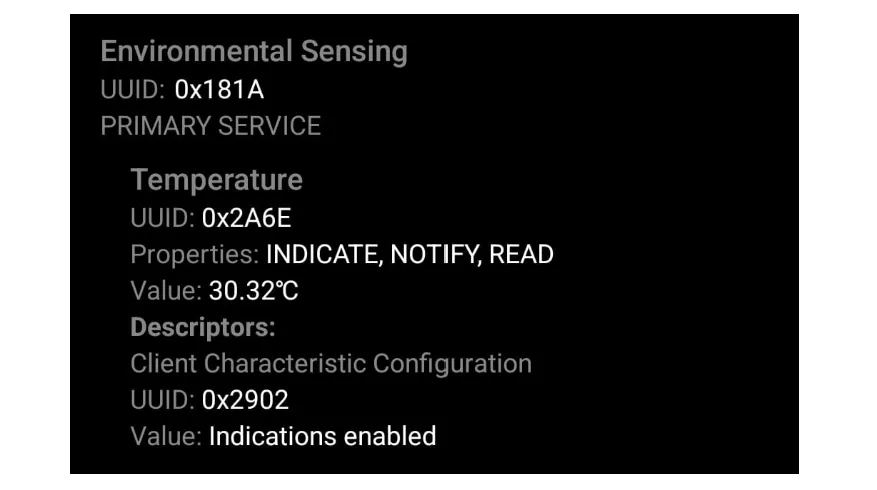

# Implementação da Conexão

Agora sim podemos começar a implementação de fato. A execução será dividida em 3 capítulos principais:

1. **Leitura da Temperatura:** O objetivo aqui é coletar dados do sensor de temperatura interno do Raspberry Pi Pico W.

2. **Anunciando para o mundo (GAP):** O objetivo aqui é configurar o dispositivo BLE para se tornar visível a outros dispositivos através do processo de advertisement (anúncio).

3. **Realizando o envio periódico de dados:** O objetivo aqui é enviar os dados de temperatura de forma periódica para dispositivos conectados.
Após anunciar, o dispositivo enviará os dados de temperatura de forma periódica para dispositivos conectados.

Cada capítulo será abordado separadamente a seguir.

### [1) Leitura da Temperatura](./0-habilitando-wireless/leitura-temperatura.md)

### [2) Anunciando para o mundo (GAP)](./1-anuncio/anuncio.md) 
 
### [3) Realizando o envio periódico de dados](./2-envio-periodico/envio-periodico.md)

---
## Considerações Finais

O projeto completo pode ser acessado na pasta `src` para download. Para realizar os testes de conexão, pode ser utilizado qualquer aplicação que suporte conexão Bluetooth LE. Exemplos:

- [nRF Connect](https://play.google.com/store/apps/details?id=no.nordicsemi.android.mcp&hl=en) (Android)
- [toolBLEx](https://github.com/emericg/toolBLEx) (Linux)
- [nRF Connect for Desktop](https://github.com/NordicSemiconductor/pc-nrfconnect-launcher) (Windows)
- [LightBlue](https://apps.apple.com/br/app/lightblue/id557428110) (iOS)

Um exemplo do que será visto no dispositivo conectado (utilizando o nRF Connect):

    

---
## [Voltar](../../README.md#conclusão)